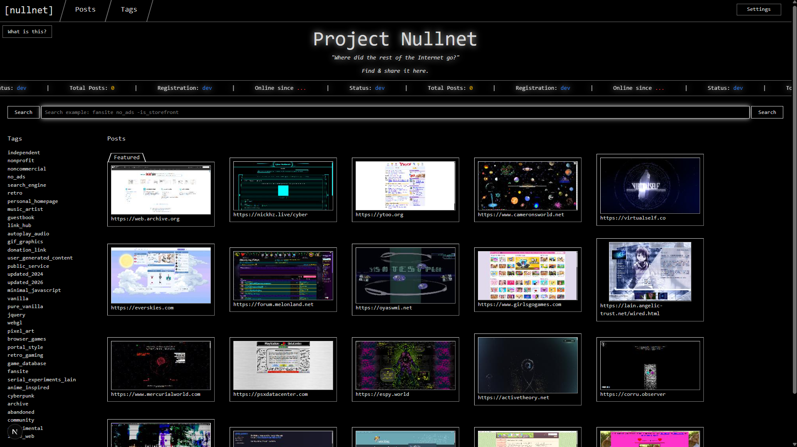

# Project Nullnet SSR Frontend
Next.JS front-end / SSR application layer for the fullstack Web project [Nullnet](https://github.com/nullnet-labs).

This is a [Next.js](https://nextjs.org) project bootstrapped with [`create-next-app`](https://nextjs.org/docs/app/api-reference/cli/create-next-app).

---

### Running Locally

With Node.js installed, open a terminal into this repo's root directory, and use this to run the development server:

```
npm run dev
```

After the above, open [http://localhost:3000](http://localhost:3000) with your browser to see the result. You should then see something similar to this:



As this application is still in early development, adjustments are still being made, and other pages are still being added.

See the [Project Nullnet organization page](https://github.com/nullnet-labs) for further documentation & repos related to this application.

---

### Copyright Notice

At the time of writing, this application is purposely not licensed for reuse. I keep the source viewable for demonstration & portfolio building.

All rights reserved.
